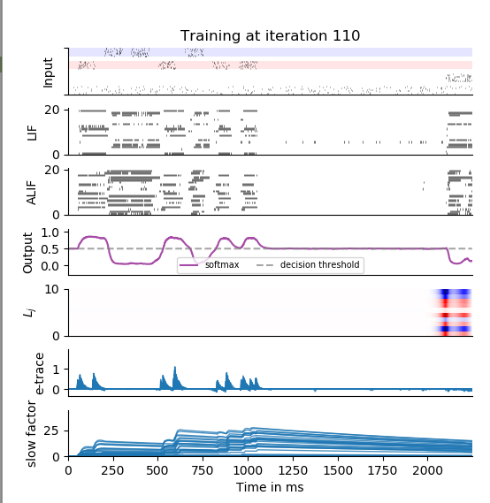

Full paper: https://arxiv.org/abs/1901.09049  
Authors: Guillaume Bellec\*, Franz Scherr\*, Elias Hajek, Darjan Salaj, Robert Legenstein, Wolfgang Maass

## Tutorial on eligibility propagation

The present tutorial is built as a single short script which trains a recurrent network (RNN) of Leaky Integrate and Fire (LIF) neurons
using the eligibility propagation (e-prop) algorithm. In the original paper three version of the algorithm are defined, e-prop #1 is provided in this tutorial.
It is meant as a simple learning rule that is partially supported by experimental data. 

There are two tutorials, one for a simple pattern generation task with LIF neurons and another task that requires temporal credit assignment which uses ALIF neurons. 

This code is written and tested with tensorflow 1.12.0, numpy 1.17.3 and python 3.6.9. This figure was obtained by running:
```tutorial_evidence_accumulation_with_alif.py -feedback random -eprop -eprop_impl hardcoded -n_batch 32```
When running the hardcoded implementation of e-prop on a GPU and encountering an OOM error, it is recommended to reduce the batch size to 16 or 8. The early stopping criterion should be reached after around 200 - 500 iterations. 


