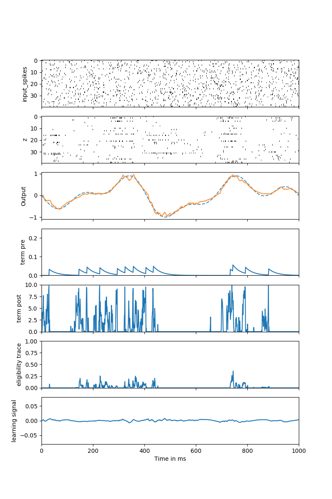

Full paper: https://arxiv.org/abs/1901.09049  
Authors: Guillaume Bellec\*, Franz Scherr\*, Elias Hajek, Darjan Salaj, Robert Legenstein, Wolfgang Maass

## Tutorial on eligibility propagation

The present tutorial is built as a single short script which trains a recurrent network (RNN) of Leaky Integrate and Fire (LIF) neurons
using the eligibility propagation (e-prop) algorithm. In the original paper three version of the algorithm are defined, e-prop #1 is provided in this tutorial.
It is meant as a simple learning rule that is partially supported by experimental data. 

This code is written and tested with tensorflow 1.12.0, numpy 1.15.4 and python 3.6.7.
When running `tutorial.py` with default parameters one should obtain after 1000 iterations (5 minutes on a laptop) the following raster plot.

